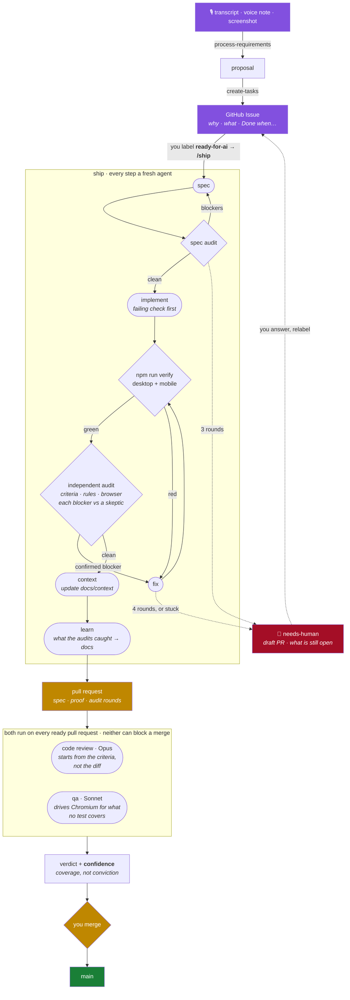
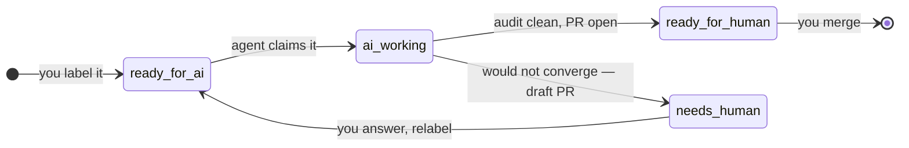

https://github.com/user-attachments/assets/7f3ea661-2e85-4895-b7b2-63f3d77a1674

# ORBIT '26

A conference companion app for a fictional applied-AI conference in Las Vegas —
four days, ~140 sessions, 110 speakers, two venues six miles apart.

It is the sample application for a workshop on using AI across the software
delivery lifecycle. **A voice note goes in one end. A merged pull request comes
out the other.** You decide what to build and what to ship; agents do the rest.

```bash
npm install && npm run dev     # seeds, starts API + web on :5173
```

No login — pick an attendee from the switcher. Two of them are also speaking.

## The pipeline



## Two harnesses

**Product** decides what to build. **Engineering** builds it. They meet at a
GitHub Issue. The skills are markdown in `.claude/skills/`; `ship` is a
workflow script in `.claude/workflows/` — together, that is the harness.

| | Skill | What it does |
| --- | --- | --- |
| 🎙️ | `listen-to-meeting` | Listens live, flags contradictions and gaps while they can still be settled in the room |
| 🎙️ | `transcribe-audio` | Whisper, locally — no hosted service, no account |
| 📋 | `process-requirements` | Distils a transcript into durable knowledge and actionable work; surfaces conflicts |
| 📋 | `create-tasks` | Raises the tickets — goal first, deduplicated, one goal each |
| 📋 | `update-context` | Folds agreed knowledge back into the project's docs |
| ⚙️ | `ship` *(workflow)* | Ticket → spec ⟲ audit → code → verify ⇄ independent audit ⟲ → context → learn → PR |
| ⚙️ | `code-review` | Fresh context, starts from the acceptance criteria, blockers only |
| ⚙️ | `qa` | Boots the app, drives Chromium, hunts what no test covers |

## How a ticket moves



**`ship` loops until it is satisfied, then stops.** It writes a spec into
`specs/` as the branch's first commit, and two agents that did not write it
audit it before any code exists. It writes a check that fails first. Then,
round after round: `npm run verify` on desktop and mobile, three independent
auditors — the ticket's criteria, `CLAUDE.md`'s rules, a browser — and a
skeptic that tries to refute each blocker before it costs a fix. **No pull
request until a round comes back clean.** Four rounds without converging, or
one finding surviving two fixes, and it hands you a **draft** saying what is
still open, rather than burning another round. Every agent starts from
[`docs/context/`](./docs/context/README.md), a map of the app, instead of
reading the source to find its way; `ship` keeps those docs current and writes
what its audits caught back into them.

**Then two agents read it**, neither having seen the reasoning that produced it
— the agent who wrote it cannot see its own misreading. Each publishes a
**confidence**, meaning coverage rather than conviction: a low-confidence pass
shows as *unproven*, not green.

Comment `@claude …` on the pull request and it makes the change and replies.
You still merge.

## Set up your fork

1. **Check the labels exist.** A new repository sets them up on its own — the
   *Set up the harness* workflow runs on the first commit. If it did not, run
   it by hand from the Actions tab. Neither a fork nor a template copies
   labels, and `ready-for-ai` is what starts everything.
2. **Settings → Actions → General → Workflow permissions → tick *Allow GitHub
   Actions to create and approve pull requests*.** Off by default on every new
   repository. Without it the agent does all the work, pushes a green branch,
   and then cannot open the pull request.
3. Add `ANTHROPIC_API_KEY` as a repository secret. **It must be scoped to a
   workspace** — an org-level key is refused, and the error does not say why.

That is all. Each agent pull request opens with **"workflows awaiting
approval"** — click it once and its checks run. That is GitHub's behaviour for
anything `github-actions[bot]` opens, and there is no setting that disables
it. Treat the click as the feature it resembles: a human checkpoint before any
agent work executes.

<details>
<summary>Running this repeatedly, and tired of clicking?</summary>

Add `AGENT_GITHUB_TOKEN` — a **fine-grained** token for this repository only,
with Contents, Issues and Pull requests set to read and write. Not a classic
token: the agent reads issue text anyone can edit, and a classic `repo` token
reaches every repository you own.
The pull request is then authored by you rather than the bot, so nothing waits
for approval and CI re-runs on the agent's own pushes. It also covers step 2
on its own.

Worth it if you are demonstrating this. Not worth handing to a room of people:
a `repo`-scoped token is a real credential, and one click is cheaper than
forty of them.
</details>

Then open an issue with a **Done when:** clause, label it `ready-for-ai`, and
watch the Actions tab.

## Commands

| | |
| --- | --- |
| `npm run dev` | Seed, then API + web together |
| `npm test` | Unit + API — no browser, under a second |
| `npm run verify` | The gate: Playwright, desktop and mobile |
| `npm run shot -- /schedule` | Screenshot a route |
| `npm run db:reset` | Rebuild the database — Day 1 becomes today |
| `node scripts/lane.mjs claim 42` | A port pair, so several agents can work at once |

Node 22 · Express · better-sqlite3 · React 18 · Vite 6 · Tailwind v4 ·
Playwright. No ORM, no state library, no component kit.

**The conference is always today.** Seeding makes Day 1 the day you run it, so
you arrive mid-conference and the clock ticks while you watch. Pin it with
`?at=YYYY-MM-DDTHH:MM`.

## Read next

- **[CLAUDE.md](./CLAUDE.md)** — architecture, conventions, and *why*. What the
  review agent checks a change against.
- **[docs/context/](./docs/context/README.md)** — one doc per area of the app;
  what agents read instead of the source.
- **[specs/](./specs/)** — one file per ticket, written before the code.
  Together, the record of how this codebase got this way.
- **[docs/DATA_MODEL.md](./docs/DATA_MODEL.md)** — the schema.
